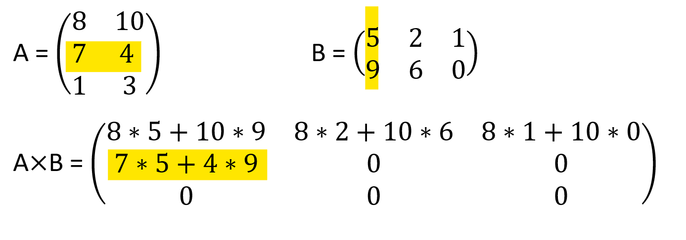

# MatrixMultiplicationConsole

The application multiplies two matrices in several ways.

A few initial rules:
* The number of columns of the 1st matrix must equal the number of rows of the 2nd matrix;
* the result will have the same number of rows as the 1st matrix, and the same number of columns as the 2nd matrix.

Initially, the application simply multiplies matrices by using the two matrices multiplication rule.
First matrix first row multiplied by second matrix first column and save in the appropriate place in the result matrix.
(The first row of matrix A is multiplied by the first column of matrix B, in our case).

Then the first row of matrix A is multiplied by the second column of matrix B.

Then the second row of matrix A is multiplied by the first column of matrix B. And so on.

Then a thread-based approach is applied to calculate the product of the separate parts of the two matrices.
